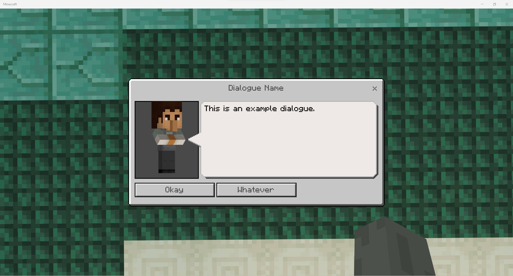
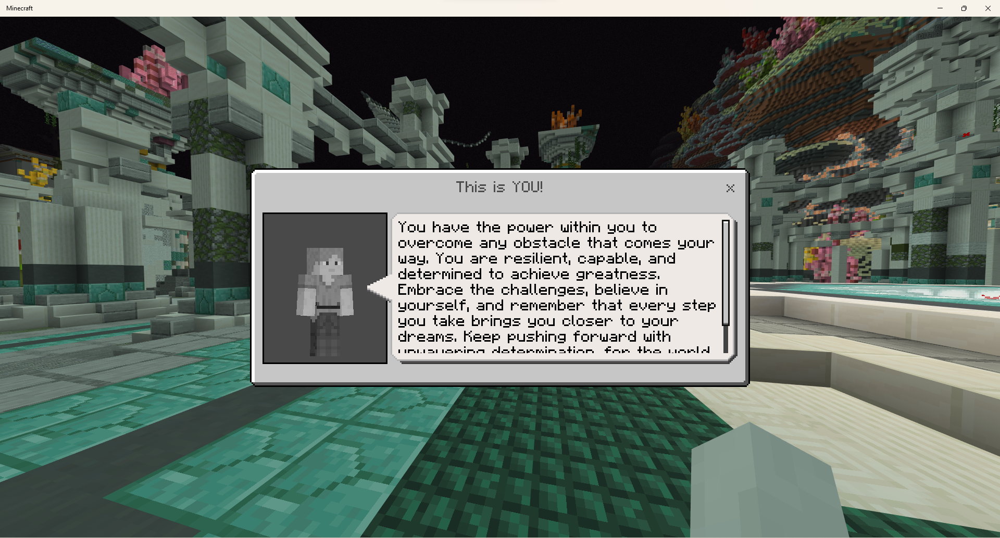
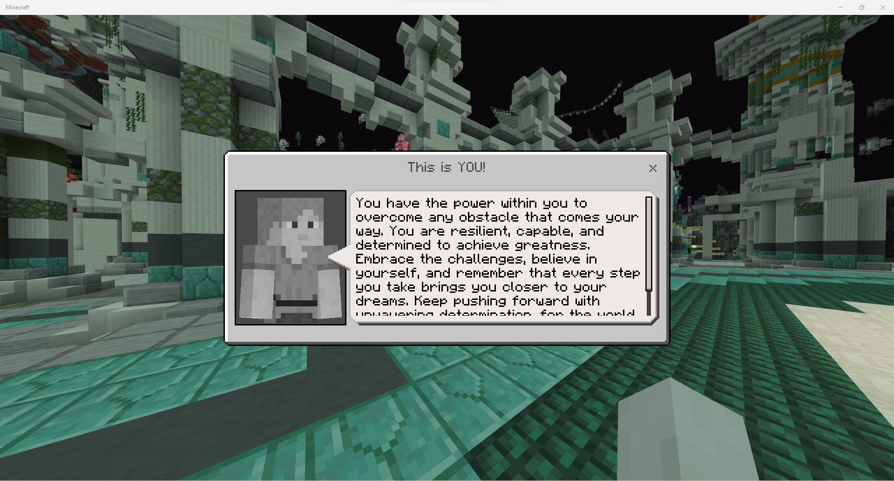

# NpcDialogue
NpcDialogue is a PocketMine-MP library for creating NPC dialogues. The library is built for portability, letting developers build dialgoues without spawning (and handling despawning of) any entities whatsoever.

The library requires event handling and therefore a plugin must  call `NpcDialogueManager::register()` on enable.

```diff
+use cosmicpe\npcdialogue\NpcDialogueManager;

protected function onEnable() : void{
+	if(!NpcDialogueManager::isRegistered()){
+		NpcDialogueManager::register($this);
+	}
}
```

## Examples
### Building a simple dialogue
The library  provides a builder class (`NpcDialogueBuilder`) to conveniently build NPC dialogue.  NPC dialogues can be sent to players using `NPCDialogueManager::send()` once built.
```php
use cosmicpe\npcdialogue\dialogue\texture\DefaultNpcDialogueTexture;
use cosmicpe\npcdialogue\NpcDialogueBuilder;
use cosmicpe\npcdialogue\NpcDialogueManager;
use pocketmine\player\Player;

$dialogue = NpcDialogueBuilder::create()
	->setName("Dialogue Name")
	->setText("This is an example dialogue.")
	->setDefaultNpcTexture(DefaultNpcDialogueTexture::TEXTURE_NPC_10)
	->addSimpleButton("Okay")
	->addSimpleButton("Whatever", function(Player $player) : void{
		$player->sendMessage("You clicked 'Whatever' button");
	})
	->setCloseListener(function(Player $player) : void{
		$player->sendMessage("You closed the dialogue");
	})
->build();
NpcDialogueManager::send($player, $dialogue);
```


### Building a dialogue with a pre-registered entity's texture
A pre-registered entity's entity identifier can be supplied to `NpcDialogueBuilder::setEntityNpcTexture()`.
```php
use cosmicpe\npcdialogue\NpcDialogueBuilder;
use cosmicpe\npcdialogue\NpcDialogueManager;
use pocketmine\network\mcpe\protocol\types\entity\EntityIds;

NpcDialogueManager::send($player, NpcDialogueBuilder::create()
	->setName("Honey Bee")
	->setText(file_get_contents("bee_movie_script.txt"))
	->setEntityNpcTexture(EntityIds::BEE)
->build());
```


### Building a dialogue with a player's skin as texture
A player skin (a `Skin` object) can be supplied to `NpcDialogueBuilder::setSkinNpcTexture()`.
```php
use cosmicpe\npcdialogue\NpcDialogueBuilder;
use cosmicpe\npcdialogue\NpcDialogueManager;

NpcDialogueManager::send($player, NpcDialogueBuilder::create()
	->setName("This is YOU!")
	->setText("You have the power within you to overcome any obstacle that comes your way. You are resilient, capable, and determined to achieve greatness. Embrace the challenges, believe in yourself, and remember that every step you take brings you closer to your dreams. Keep pushing forward with unwavering determination, for the world awaits the extraordinary impact you're destined to make.")
	->setSkinNpcTexture($player->getSkin())
->build());
```


You can set 'portrait offset' of player skins to adjust scale of the texture.
```php
use cosmicpe\npcdialogue\NpcDialogueBuilder;
use cosmicpe\npcdialogue\NpcDialogueManager;

$parent = NpcDialogueTextureOffset::defaultPlayerPortrait();
$portrait_offset = new NpcDialogueTextureOffset(2.0, 2.0, 2.0, $parent->translate_x, $parent->translate_y, $parent->translate_z);
NpcDialogueManager::send($player, NpcDialogueBuilder::create()
	->setName("This is YOU!")
	->setText("You have the power within you to overcome any obstacle that comes your way. You are resilient, capable, and determined to achieve greatness. Embrace the challenges, believe in yourself, and remember that every step you take brings you closer to your dreams. Keep pushing forward with unwavering determination, for the world awaits the extraordinary impact you're destined to make.")
	->setSkinNpcTexture($player->getSkin(), null, $portrait_offset)
->build());
```
